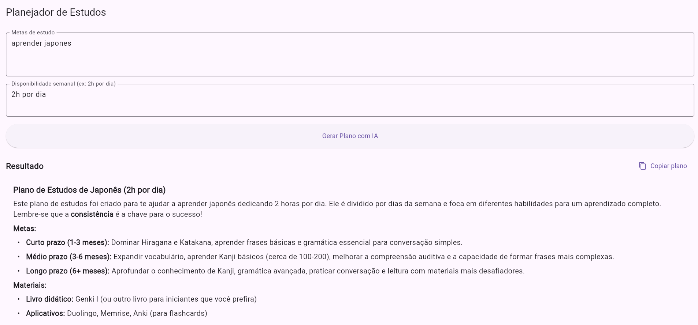

# Planejador de Estudos - Projeto de Aplicativo de Planejamento Personalizado

**Autor:** Gustavo Jesus Ribeiro Lima

---

## Descrição do App

O **Planejador de Estudos** é um aplicativo Flutter que gera planos de estudo personalizados para os usuários com base em suas metas e disponibilidade. Utilizando a inteligência artificial da API Gemini, o app cria planos adaptáveis para diferentes áreas de estudo, otimizando a forma como os usuários organizam e gerenciam seus estudos. Ideal para estudantes que querem otimizar seu tempo de estudo e garantir que estão cobrindo todas as áreas necessárias de forma eficiente.

---

## Imagens do App



---

## Tecnologias Utilizadas

- **Flutter:** Framework para construção do aplicativo móvel.
- **Dart:** Linguagem de programação usada no Flutter.
- **Gemini API (LLM):** API de IA utilizada para gerar planos de estudo personalizados com base nas preferências do usuário.

---

## Instruções de Instalação e Execução

1. **Clone o repositório**

```bash
git clone https://github.com/GustavoJRLima/planejador-de-estudos-com-LLM.git
cd planejador-de-estudos-com-LLM.git
```

2. **Instale as dependências do Flutter**

```bash
flutter pub get
```

3. **Execute o aplicativo**

```bash
flutter run
```
---

## Como o LLM foi Utilizado
O Planejador de Estudos utiliza a API Gemini (um modelo de linguagem de IA) para gerar planos de estudo personalizados. Através de uma simples interação com o usuário, o aplicativo coleta informações como metas de estudo e disponibilidade de tempo, e envia esses dados para a API.

A resposta da API é então processada e exibida como um plano de estudo detalhado, que pode ser ajustado conforme necessário. O uso do LLM da Gemini permite que o plano de estudo seja altamente adaptável, considerando a quantidade de tempo disponível e os objetivos específicos do usuário.

Além disso, a API Gemini também é responsável por recomendar recursos de aprendizado, como vídeos, livros e cursos, de acordo com o plano gerado.